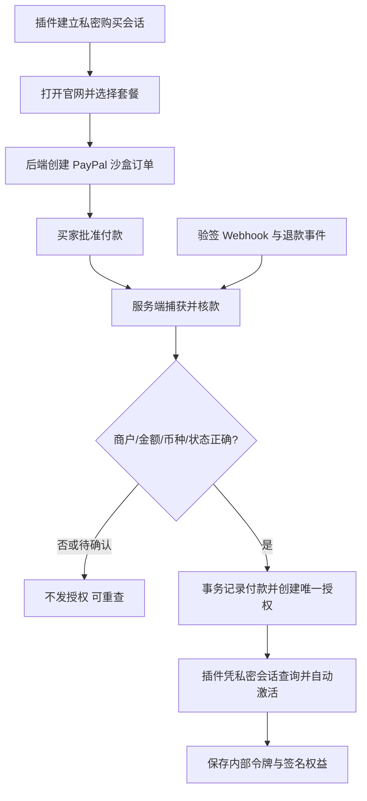
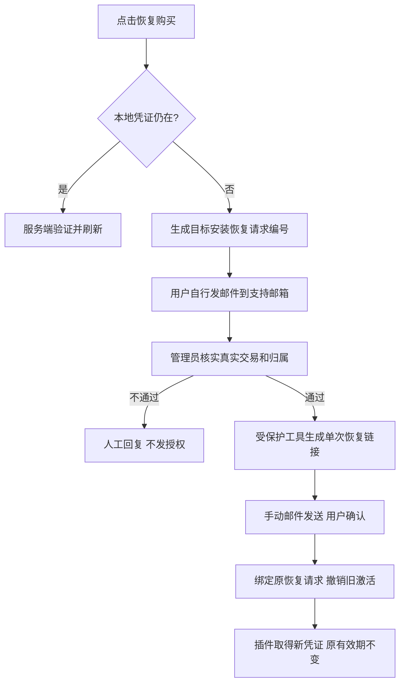
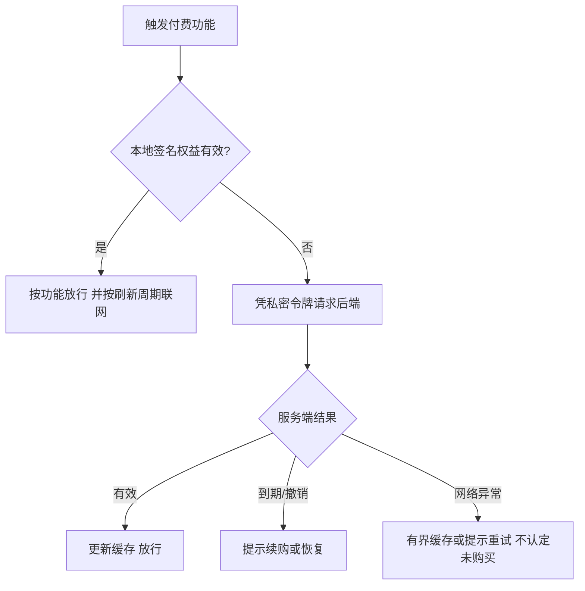

# 1.3 自动激活与恢复流程

以 DEVELOPMENT_DESIGN.md 为接口/安全规则来源，流程图省略密钥和原始个人信息。

## 购买

```mermaid
flowchart TD
 A[插件建立私密购买会话] --> B[打开官网并选择套餐]
 B --> C[后端创建 PayPal 沙盒订单]
 C --> D[买家批准付款]
 D --> E[服务端捕获并核款]
 E --> F{商户/金额/币种/状态正确?}
 F -->|否或待确认| G[不发授权 可重查]
 F -->|是| H[事务记录付款并创建唯一授权]
 I[验签 Webhook 与退款事件] --> E
 H --> J[插件凭私密会话查询并自动激活]
 J --> K[保存内部令牌与签名权益]
```

浏览器返回与通知独立；关闭网站/popup 后可继续重查。退款处理是状态机独立分支，不能将退款事件当新付款。

## 恢复

```mermaid
flowchart TD
 A[点击恢复购买] --> B{本地凭证仍在?}
 B -->|是| C[服务端验证并刷新]
 B -->|否| D[生成目标安装恢复请求编号]
 D --> E[用户自行发邮件到支持邮箱]
 E --> F[管理员核实真实交易和归属]
 F -->|不通过| G[人工回复 不发授权]
 F -->|通过| H[受保护工具生成单次恢复链接]
 H --> I[手动邮件发送 用户确认]
 I --> J[绑定原恢复请求 撤销旧激活]
 J --> K[插件取得新凭证 原有效期不变]
```

## 功能校验

```mermaid
flowchart TD
 A[触发付费功能] --> B{本地签名权益有效?}
 B -->|是| C[按功能放行 并按刷新周期联网]
 B -->|否| D[凭私密令牌请求后端]
 D --> E{服务端结果}
 E -->|有效| F[更新缓存 放行]
 E -->|到期/撤销| G[提示续购或恢复]
 E -->|网络异常| H[有界缓存或提示重试 不认定未购买]
```
